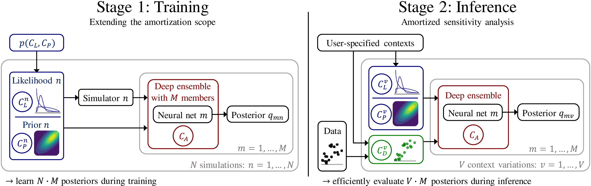

# Sensitivity-Aware Amortized Bayesian Inference (SA-ABI)



This repository contains the code for running and reproducing the experiments from the paper [Sensitivity-Aware Amortized Bayesian Inference](https://openreview.net/forum?id=Kxtpa9rvM0), published in Transactions on Machine Learning Research ([arXiv version](https://arxiv.org/abs/2310.11122)).

SA-ABI is a simulation-based method for fully amortized sensitivity analysis across all major dimensions of a Bayesian model: likelihood, prior, approximator, and data. This is achieved by training a deep ensemble of neural networks to amortize over a familiy of computational models.

The code depends on the [BayesFlow](https://github.com/stefanradev93/BayesFlow) library, which implements the neural network architectures and training utilities.

## Cite

The article can be cited as:

```bibtex
@article{elsemueller2024sensitivity,
  title={Sensitivity-Aware Amortized Bayesian Inference},
  author={Lasse Elsem{\"u}ller and Hans Olischl{\"a}ger and Marvin Schmitt and Paul-Christian B{\"u}rkner and Ullrich Koethe and Stefan T. Radev},
  journal={Transactions on Machine Learning Research},
  issn={2835-8856},
  year={2024},
  url={https://openreview.net/forum?id=Kxtpa9rvM0},
}
```

## [notebooks](notebooks)

Contains the main analysis code for each experiment in self-contained Jupyter notebooks and supporting Python scripts:

- [Experiment 1: COVID-19 Outbreak Dynamics](notebooks/covid)
- [Experiment 2: Climate Trajectory Forecasting](notebooks/climate)
- [Experiment 3: Hierarchical Models of Decision-Making](notebooks/levy_comparison)
- [Additional OOD Tests for Experiment 3](notebooks/typical_set)


## [src](src)

Contains custom [Julia](src/julia) and [Python](src/python) functions that enable the analyses.

## Support

This work was supported by the Deutsche Forschungsgemeinschaft (DFG, German Research Foundation) under the research training group Statistical Modeling in Psychology (SMiP; GRK 2277) and under Germany’s Excellence Strategies EXC-2075 - 390740016 (the Stuttgart Cluster of Excellence SimTech) and EXC-2181 - 390900948 (the Heidelberg Cluster of Excellence STRUCTURES). Additionally, it was supported by the Google Cloud Research Credits program (award GCP19980904), the state of Baden-Württemberg through bwHPC, the Cyber Valley Research Fund (grant number: CyVy-RF-2021-16), and the Informatics for Life initiative funded by the Klaus Tschira Foundation.

## License

MIT
